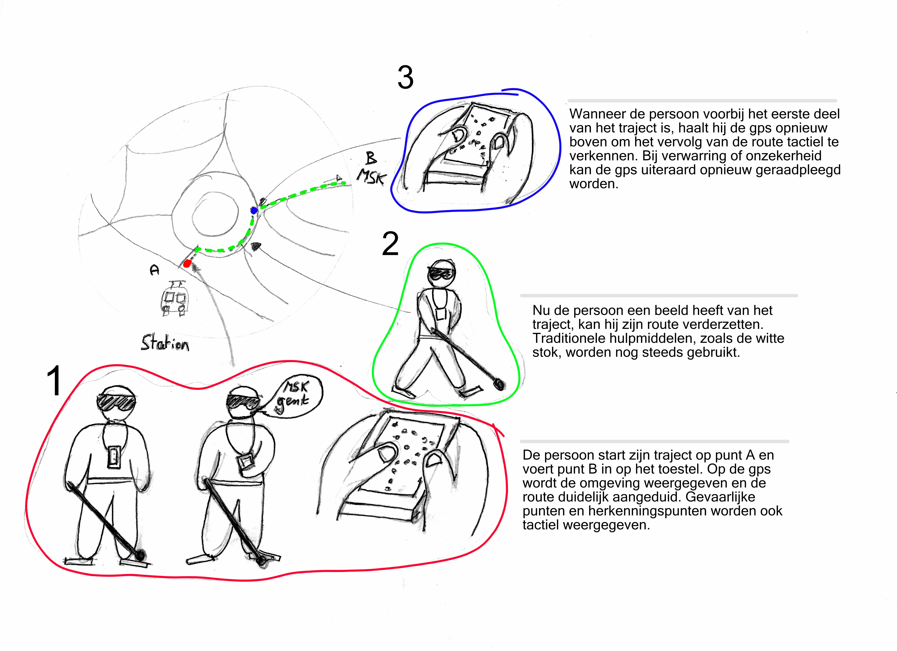
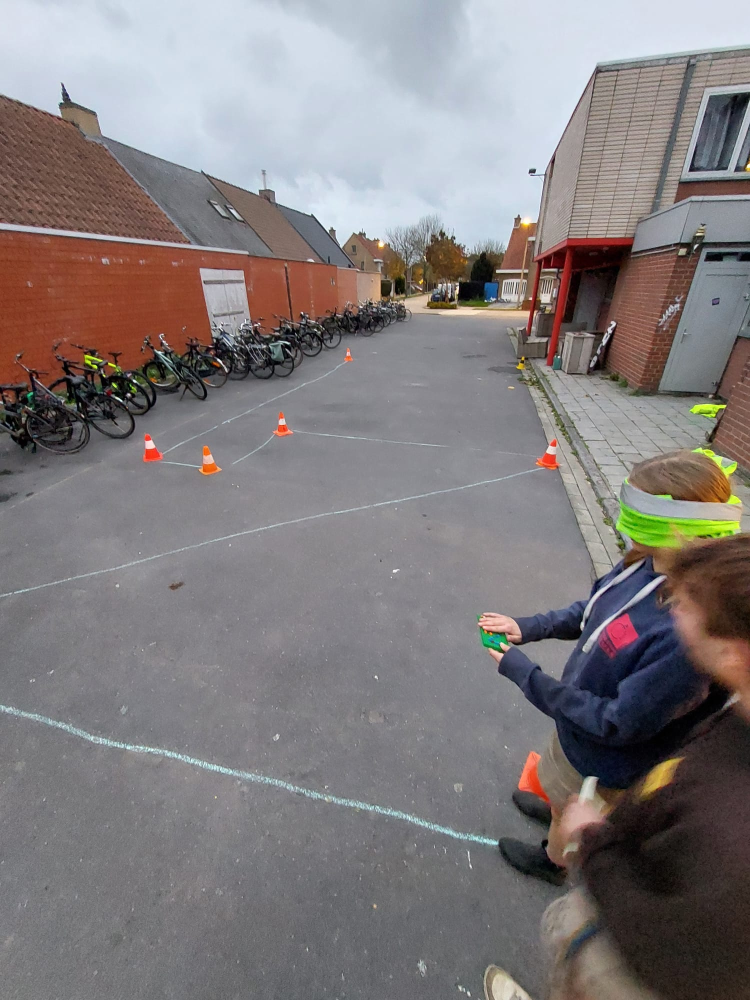
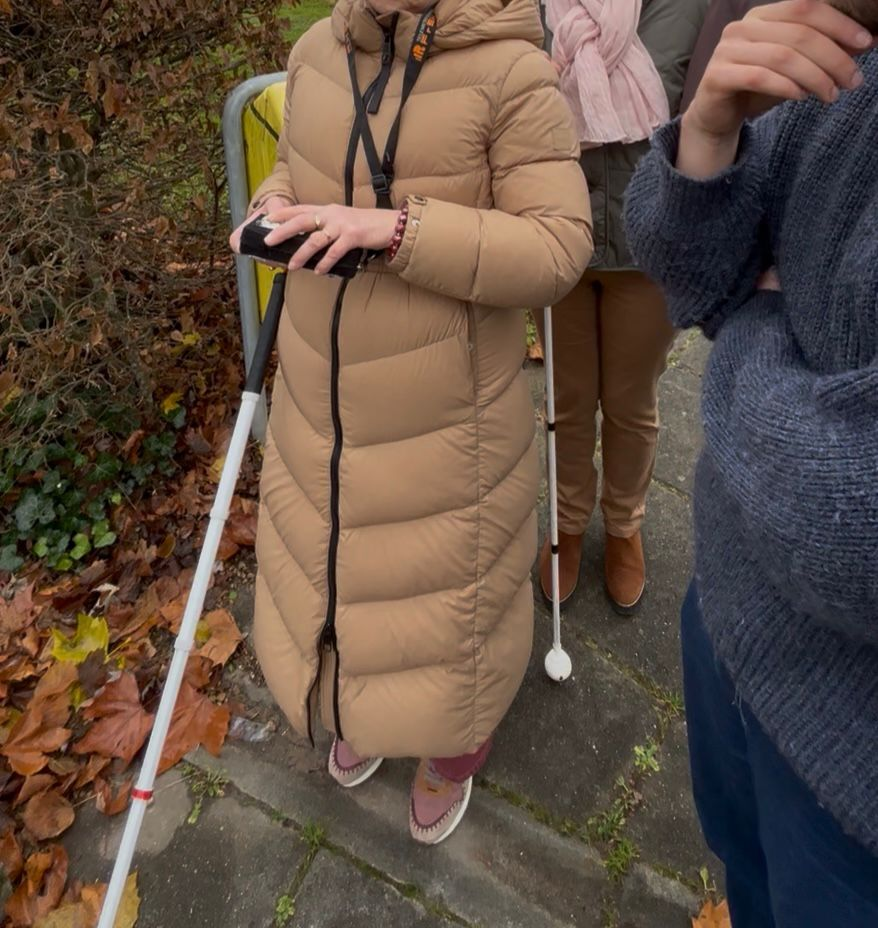
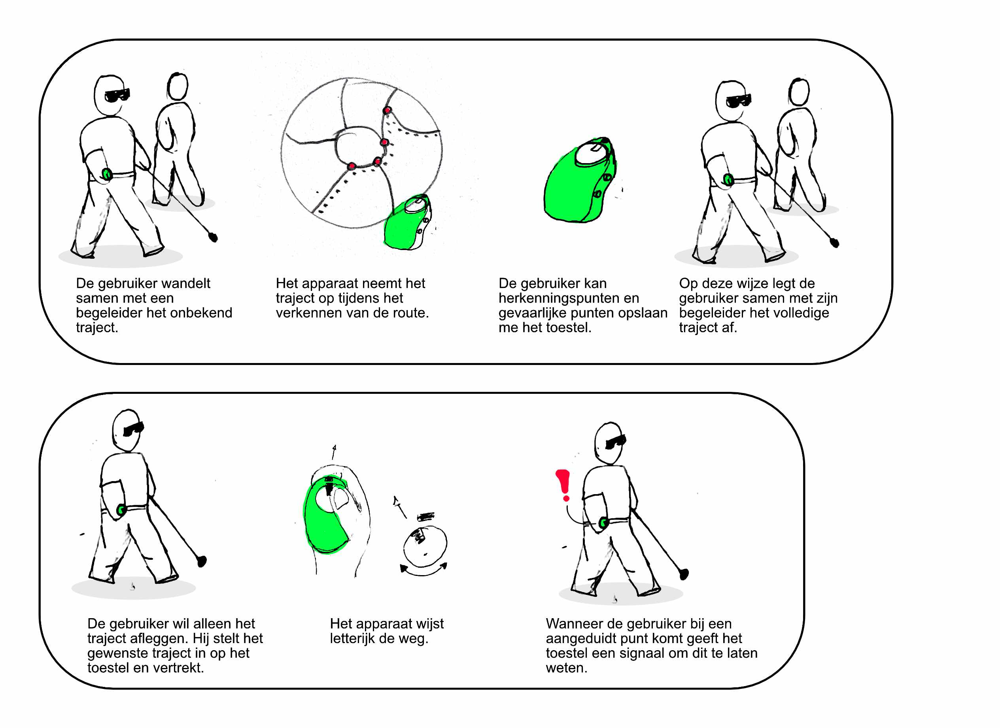

## Definition

# Iteratie 1 
### Doestellingen

In deelopdracht 2 (Definition Phase) zijn eerste low-fidelity prototypes ontwikkeld. Het doel was te onderzoeken of het concept van een tactiele kaart als ruimtelijk referentiekader begrijpelijk, bruikbaar en zinvol is voor mensen met een visuele beperking. De focus lag expliciet op “Design the Right Thing” vóór technologische verfijning.

Kernvragen waren:

- Hoe interpreteren gebruikers tactiele kaartinformatie?

- Hoe verkennen zij een tactiel oppervlak?

- Hoe leesbaar en resoluut zijn de kaarten?

- Welke functies maken het product bruikbaar (bijv. inzoomen, geluid instellen, bewegen met de kaart)?

- Welke interactiemethoden en draagwijzen zijn geschikt?

De werking is als volgt:

  

### Materiaal & methoden
De eerste wave bouwen we op uit meerdere kleine testen waarmee we onze deelvragen beantwoorden. Hierna testen we het totaal concept.

#### 1. Orientatie N = 10

Het onderzoek onderzocht hoe gebruikers navigeren met tactiele kaarten. Tien geblinddoekte jongeren zonder visuele beperking legden een parcours af met een tactiele LEGO-kaart en/of verbale instructies. Twee groepen werden vergeleken: kaart + instructies versus alleen instructies, waarbij gedrag en tijd werden geregistreerd.

  

#### 2. Kaart afmetingen N = 2

We onderzochten welke kaartresolutie het best tactiel waarneembaar is. Testpersonen verkenden meerdere kaarten met hetzelfde patroon maar verschillende resoluties en beschrijven wat ze voelden. Omdat alle kaarten hetzelfde patroon bevatten, lag de focus op de subjectieve ervaring: welke kaart voelde het duidelijkst en meest leesbaar aan? De test werd uitgevoerd met twee blinden.

  

#### 3. Draagwijzen N = 6 

Blinden en slecht zienden lopen bijna altijd met de stok rond hierdoor is er dus nog maar een van hun handen vrij wanneer ze op stap gaan. Daardoor willen we testen op welke manier het product kan gedragen worden. Hiervoor hebben we drie opstellingen: het product los in de ene hand , het product bevestigd aan de arm met behulp van een brace, het product met daaraan een lanyard voor rond de nek te draggen.

  

  

De testpersonen kregen elk individueel alle verschillende opstellingen in de hand en mochten daarmee dan ook rondlopen. De meningen van iedereen werden ook in groep besproken.

#### 4. interactiemethoden N = 6 

Het product moet natuurlijk te besturen zijn , hiervoor zijn dan ook verschillende inputs voor nodig. Voor dit te testen werd gebruikgemaakt van een adaptief prototype met velcro waar verschillende soorten knoppen, draaiwielen, sliders en joysticks aan bevestigd kunnen worden.

  

Deze kunnen dan georiënteerd worden zoals de gebruiker ze het liefst wilt.

  

#### 5. Concept validatie N = 2 

Deelnemers legden een vooraf uitgestippeld traject af met opeenvolgende tactiele kaarten, elk met een begin- en eindpunt. Bij aankomst ontvingen ze een nieuwe kaart en gebruikten de think-aloud-methode tijdens interpretatie. Kaarten waren noordgericht, met GPS-feedback, en interventies bij fouten of veiligheidsrisico’s werden direct toegelicht. Zo werd geëvalueerd hoe goed deelnemers hun omgeving begrijpen via de kaarten.

  

  

### Resultaten

Bij het testen van het totaalconcept kwamen meerdere fundamentele problemen naar voren. Gebruikers konden het traject interpreteren, maar een globale richtingsaanduiding alleen was onvoldoende voor zelfverzekerd navigeren. De complexiteit van de echte omgeving overstijgt de vereenvoudigde kaartweergave, waardoor cruciale context ontbreekt tijdens het wandelen.

Belangrijkste bevindingen:

- Een top-down Google Maps-achtige weergave is niet intuïtief voor blinde gebruikers.

- Effectieve oriëntatie vereist een dynamische, meedraaiende kaart met een duidelijk referentiepunt.

- Routeplanning is mogelijk, maar vraagt extra, duidelijk onderscheidbare feedback.

- Schaal, obstakels en hoogte-informatie bepalen de bruikbaarheid van de kaart.

- De kaart ondersteunt het initiële beslismoment, maar biedt onvoldoende begeleiding tijdens de voortbeweging.

Design Requirements:

- D1.4 Orientatie/richting van de route weergeven
- D2.2 Cognitieve belasting moet zo laag mogelijk zijn
- D2.3 bruikbaar na een uitlegsessie 
- D2.6 De bedieningsknoppen moeten een voelbare range hebben
- D2.8 Het product moet met 1 hand bruikbaar zijn
- D2.9 Contrast en kleur aanpasbaar aan voorkeur van gebruiker
- D4.1 Het product moet het zelfvertrouwen van de gebruiker versterken

### Conclusies & implicaties

De pinmatrix blijkt cognitief belastend en verwarrend. Gebruikers kunnen globale route-informatie afleiden, zoals rechtdoor, links of rechts, maar na zo’n beslismoment ontbreekt continuïteit en context om verder te navigeren. Het verkleinen van de schaal maakt de kaart te abstract en moeilijk bruikbaar.

In essentie blijft er een pijl over die een richting aangeeft.
Hiernaast willen we nog eens dieper ingaan op wat een blinde nodig heeft om comfortabel en zelfzeker een route te bewandelen. Dit bekijken we in iteratie 2.

# Iteratie 2
In deze wave willen we volgend concept onderzoeken:

  

Hierbij willen we ook antwoord op volgende vragen:
1.	Welke informatie is daadwerkelijk nodig om blinden en slechtzienden comfortabel en met vertrouwen te begeleiden tijdens het navigeren?
2.	In welke situaties en mentale toestanden zou een blinde gebruiker dit product effectief willen gebruiken? 
3.	Is het mogelijk om blinden en slechtzienden effectief te sturen door uitsluitend (of voornamelijk) richting aan te geven met een pijl, en zo ja, onder welke voorwaarden

### Materiaal & methoden N = 2 
We doen dit aan de hand van enkele interviews gevolgt door usability testing.
Tijdens de interviews gaan we nog eens dieper in op de noden van de gebruikers en wanneer zo een toestel handig zou zijn. 

Bijkoment gaan we op wandel om een simpel pijlprototype te analyseren. Voor deze fase hebben we twee blinden en een begeleidster geraadpleegt.

  

  

### resultaten

Navigatie hangt af van zelfvertrouwen, herkenningspunten, herhaling en begeleiding. Voor blinden zijn een witte stok en een gsm voor noodgevallen essentieel.

Er is grote diversiteit binnen de blinde gemeenschap: sommige mensen zijn zelfstandig, terwijl anderen zonder begeleiding nauwelijks durven bewegen. Voor hen kan het wegwijzerconcept houvast en actieve ondersteuning bieden. Zelfzekere gebruikers hebben eerder baat bij hulpmiddelen die waarschuwen bij uitzonderingssituaties. Het pinmatrixconcept is vooral geschikt voor thuisgebruik, waar routes vooraf verkend en ingeoefend kunnen worden, zonder beperkingen qua omvang of draagbaarheid.

Design Requirements:

- D1.5 Verwarring bij start  van traject vermijden
- D1.6 Gebruiker kan zijn eigen herkennigspunten maken
- D5.3 Compatibel met IOS 