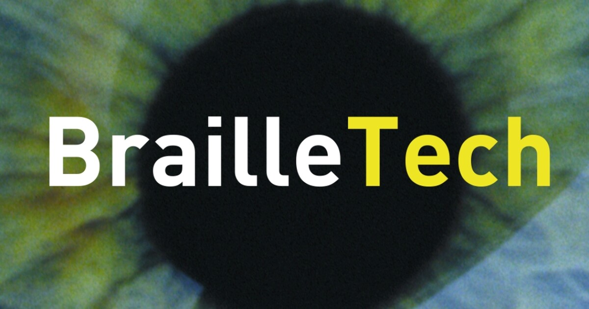

## Discovery
Max. 1000 woorden.   
[!] Algmeen: Maak voldoende gebruik van schematische/grafische weergaves en tabellen.
### Doestellingen
Het doel van de discoveryfase was om inzicht te verkrijgen in de leefwereld van blinde en slechtziende personen. Met als focus hun dagelijkse leven en uitdagingen ontdekken. Uitendelijk willen we uit deze inzichten een "how might we" vraag opstellen. 

### Materiaal & methoden
Tijdens de discorvey fase gebruiken we verschillende kwalitatieve onderzoeksmethoden. We voerden interviews, benchmarks en een literatuur studie uit.

Wat de meest uitdagende taak bleek was het rondsellen van respondenten. Gelukkig was er toevallig in die periode een beurs.

  

We  bezochten de jaarlijkse Brailletech-beurs. Tijdens deze beurs werden de nieuwste hulpmiddelen voor blinde en slechtziende gebruikers voorgesteld. De beurs bood een waardevolle gelegenheid om:

- in contact te komen met blinde en slechtziende bezoekers;
- te spreken met experts en ontwikkelaars van hulpmiddelen (zoals Sensotec);
- inzicht te krijgen in bestaande technologieën en ondersteuningsinitiatieven.

Daarnaast kwamen we via vrienden en familie in contact met een bereidwillige slechtziende persoon die openstond om ons verder te ondersteunen tijdens het project.

Ook bezochten we het oogatelier van Licht en Liefde in Kortrijk, een ontmoetingsplaats voor blinde en slechtziende personen. Hier konden we ook terecht om mensen te interviewen.

#### Interviews
we gingen elk appart op stap om respondenten te interviewen. Daarvoor maakten we elk ons eigen protecol en rapport.
De protocol van de interviews zijn hier te lezen: 

 [- Lander: Protocol interviews](<../reports and protocols/Protocol Interviews.pdf>)

 [- Roland: Protocol interviews](<../reports and protocols/Interviewprotocol_slechtzienden_!.pdf>)

 [- Corbin: Protocol interviews](<../reports and protocols/Interview-protocol-Corbin_Braekevelt.pdf>)

De rapports zijn hier te lezen: 

[- Lander: Rapport interviews](<../reports and protocols/Rapport Interviews.pdf>)

[- Roland: Rapport interviews](<../reports and protocols/Analyse respondenten rapport.pdf>)

[- Corbin: Rapport interviews](<../reports and protocols/Interview-raport-Corbin_Braekevelt.pdf>)

De interviews waren breed opgezet en behandelde verschillende thema's, waaronder mobiliteit, communicatie, sociale media, vrije tijd, hobby's en veiligheid. Op basis van deze verkennende gesprekken besloten we ons verder te focussen op mobiliteit, en meer specifiek op navigatie.

Met een focus op navigatie zijn we naar de braillebeurs getrokken.

#### Benchmarks en literatuurstudie

Protocollen van de literatuurstudies: 
Naast de interviews voerden we ook benchmarks en literatuurstudies uit naar bestaande hulpmiddelen en technologieën, om een breder beeld te krijgen van het huidige aanbod en de bestaande oplossingen. 
Hiervoor werden ook protocollen en raporten voor opgesteld:

[- Lander: Protocol literatuurstudie](<../reports and protocols/Protocol Literatuur Studie.pdf>)

[- Roland: Protocol benchmarking](<../>)

[- Corbin: Protocol benchmarking](<../reports and protocols/benchmarking_protocol_corbin_braekevelt.pdf>)

[- Lander: Rapport literatuurstudie](<../reports and protocols/Rapport Literatuur Studie.pdf>)

[- Roland: Rapport benchmarking](<../reports and protocols/Competitor analysis.pdf>)

[- Corbin: Rapport benchmarking](<../reports and protocols/benchmarking_raport_corbin_braekevelt.pdf>)

### Resultaten

#### Inzichten uit de interviews en observaties:

Er werden verschillende interviews afgenomen met blinde en slechtziende personen, aangevuld met informele gesprekken met organisaties en bedrijven op de Brailletech-beurs. Het doel was inzicht te krijgen in hun leefwereld, met een specifieke focus op mobiliteit en navigatie. Ondanks verschillen in leeftijd en context kwamen in alle gesprekken gelijkaardige patronen naar voren.

Een centraal inzicht is dat zelfstandige mobiliteit voor blinde personen sterk steunt op aangeleerde trajecten. Routes worden bewust voorbereid, ingeoefend en onderhouden, vaak met ondersteuning van een vertrouwd persoon. Onvoorspelbare factoren zoals wegenwerken, foutieve of slecht onderhouden infrastructuur en drukke stedelijke omgevingen zorgen voor onzekerheid en frustratie. Navigeren in binnenruimtes, zoals openbare gebouwen, blijkt daarbij vaak moeilijker dan buiten.

Digitale hulpmiddelen zoals gps-apps en smartphones worden gebruikt, maar blijken niet altijd betrouwbaar of praktisch in gebruik. Betrouwbaarheid en accuraatheid zijn essentieel,twijfel tijdens het navigeren wordt als onaanvaardbaar ervaren. Daarnaast blijkt gezelschap een belangrijke rol te spelen in het gevoel van veiligheid en vertrouwen.

Belangrijkste bevindingen:

- Sterke afhankelijkheid van aangeleerde trajecten

- Grote impact van infrastructuur en onderhoud

- Beperkingen van bestaande digitale hulpmiddelen

- Betrouwbaarheid van hulpmiddelen is essentieel

- Cruciale rol van vertrouwen, veiligheid en gezelschap

#### Inzichten uit de literatuur studie:

De geraadpleegde literatuur toont aan dat blinde personen effectief ondersteund kunnen worden door verschillende technologieën die tastzin, gehoor en beweging gebruiken of combineren. Hoewel traditionele hulpmiddelen zoals de witte stok en oriëntatietrainingen essentieel blijven, wijst onderzoek op een aanzienlijk potentieel van tactiele en haptische feedbacksystemen. Daarnaast tonen verschillende studies aan dat het gebruik van braillekaarten het oriëntatievermogen versterkt en bijdraagt aan het opbouwen van mentale kaarten van de omgeving.

Een terugkerend aandachtspunt in de literatuur is dat hulpmiddelen eenvoudig, betrouwbaar en gebruiksvriendelijk moeten blijven. Daarnaast benadrukken meerdere studies het belang van co-creatie: oplossingen die ontwikkeld worden in nauwe samenwerking met de doelgroep sluiten beter aan bij reële noden.

Opvallend is dat veel technologische oplossingen voornamelijk getest worden in gecontroleerde of gesimuleerde omgevingen. De overgang naar complexe, onvoorspelbare real-life contexten blijkt daarbij vaak een struikelblok, waardoor het product uitendelijk faalt.

### Conclusies & implicaties

Een van de belangrijkste bevindingen uit dit onderzoek is dat veel slechtzienden personen, en blinde gebruikers, sterk steunen op aangeleerde trajecten. Zelfstandige verplaatsing is voor hen mogelijk zolang een route vooraf zorgvuldig wordt aangeleerd en door regelmatige herhaling wordt onderhouden.

Dit inzicht werd onder meer geïllustreerd door het verhaal van Pieter-Jan, die volledig blind is. <em>Hij gaf aan dat hij samen met zijn slechtziende vrouw routes uitstippelt in hun thuisstad Antwerpen.</em> Dit voorbeeld toont aan dat zelfstandige mobiliteit niet spontaan ontstaat, maar het resultaat is van bewuste voorbereiding, herhaling en externe ondersteuning.

Op basis van dit inzicht creeëren we De "How Might We" vraag:
>'Hoe kunnen we blinde personen ondersteunen bij het aanleren en onderhouden van trajecten?'

  

Als eerste conceptuele richting ontstond het idee van een tactiel navigatiesysteem, een soort van "tactiele gps". Met dit concept starten we de definitie fase.

Design Requirements:
- D1.1 aangeleerde trajecten onderhouden
- D1.2 Nieuwe trajecten aanleren
- D2.7 Docking station waar het product kan laden en een vaste plaats heeft
- D2.4 UI geschikt voor blinden en slechtzienden
